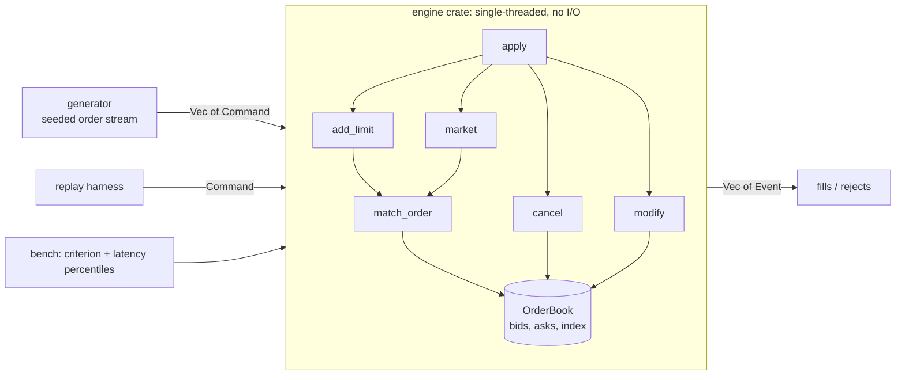

# lobster

A limit order book matching engine in Rust, built to explore low-latency systems design: cache-friendly data structures, allocation-free hot paths, and honest measurement.

> Status: v1 (naive, correct, measured). v2 (array-indexed levels + slab) in progress.

## What is an order book?

An exchange matches buyers and sellers. The order book holds every unfilled order: **bids** (buyers, highest price first) and **asks** (sellers, lowest price first). When a new order crosses the spread, it trades against resting orders by **price-time priority**: best price first, and within a price, first-come first-served. Whatever doesn't trade rests in the book.

```
        ASKS (sellers)
  price   qty
   103     40
   102     15
   101     25    <- best ask
  ---------------  spread
   100     30    <- best bid
    99     10
    98     50
        BIDS (buyers)
```

An incoming **buy at 101 for 30** fills 25 at 101, then rests 5 at 101 as the new best bid.

## Why this project

Matching is the canonical low-latency problem: memory layout, allocation, cache behaviour, and tail latency all matter. The goal is not a full exchange (no networking, auth, or persistence). It is the core engine, built in versions, with each optimisation justified by numbers.

## Architecture



The engine is a pure library: `book.apply(command) -> Vec<Event>`. It has zero dependencies. The generator, replay and benchmarks live in separate crates so the hot path stays clean.

### Repository layout

```
lobster/
├── Cargo.toml          workspace root, release profile (LTO, panic=abort)
├── engine/             the order book (no dependencies)
│   ├── src/types.rs    Price, Qty, Order, Command, Event, RejectReason
│   ├── src/book.rs     OrderBook
│   └── tests/          unit tests + property tests (proptest)
├── generator/          deterministic synthetic order stream (seeded RNG)
└── bench/              criterion throughput bench + latency percentile binary
```

### Data model (v1)

```
bids:  BTreeMap<Price, VecDeque<Order>>   best = last key
asks:  BTreeMap<Price, VecDeque<Order>>   best = first key
index: HashMap<OrderId, (Side, Price)>    locates a resting order for cancel/modify
```

Prices and quantities are integers (`u32` ticks and lots). Never floats.

## Order semantics

| Command | Behaviour |
|---|---|
| `Add` (limit) | Matches while it crosses the spread, fills at the **maker's** price, FIFO within a level. Remainder rests at the back of its level. |
| `Market` | Matches against the opposite side at any price. Unfilled remainder is **cancelled, never rested**. If nothing fills, `Rejected(NoLiquidity)`. |
| `Cancel` | Removes a resting order. Unknown id (already filled, already cancelled, never existed) gives `Rejected(UnknownOrder)`. |
| `Modify` | Qty decrease keeps queue position. Qty increase loses priority (moves to the back). |

Other rejects: `InvalidQty` (qty = 0), `DuplicateId` (id already live). Bad input never panics.

## Correctness

* Unit tests for priority, partial fills, level sweeping, maker-price fills, and rejects on both sides.
* Property tests (`proptest`) run random command sequences and check after every command:
  * the book is never crossed (`best_bid < best_ask`)
  * the index and the book contain exactly the same orders
  * no empty levels, no zero-qty resting orders
  * quantity conservation across add, market, cancel, modify

```bash
cargo test --workspace
```

## Benchmarks

### Method

* Workload: 1,000,000 commands from the seeded generator (seed 42), around a drifting mid price. About 45% cancels, 5% market orders, the rest limit orders, some of which cross the spread.
* Per-op latency is measured with `Instant` around each `apply` call; the timer's own overhead is measured and subtracted.
* Warmup run on a throwaway book first. Release profile with LTO.
* Throughput is measured separately with criterion over a full replay.
* Tail percentiles (p99, p99.9) are the numbers to trust. At this scale the timer overhead is comparable to the median, so p50 is indicative only.

```bash
cargo bench -p bench                        # replay throughput (criterion)
cargo run --release -p bench --bin latency  # per-op percentiles
```

### Results

Machine: \_Apple M5 air 15'? / RAM\_16GB, macOS, plugged in, nothing else running.

| Version | Replay throughput | Mean/op | p50 | p90 | p99 | p99.9 | max |
|---|---|---|---|---|---|---|---|
| v1: BTreeMap + VecDeque | 21.8 M ops/s | ~46 ns | 10 ns\* | 51 ns | 93 ns | 177 ns | 66.6 µs |
| v1.1: + fast hasher, index sized to workload (16k) | 28.0 M ops/s | 13 ns\* | 13 ns\* | 96 ns | 179 ns | ~18-37 µs |
| v2: slab + intrusive level lists (O(1) cancel) | 32.5 M ops/s | 11 ns\* | 12 ns\* | 54 ns | 137 ns | 14.7 µs |

\* within timer noise (timer overhead 32 ns).

Workload: 1,000,000 commands, seed 42. Throughput is criterion's median over 10 samples (95% interval 21.0 to 22.2 M ops/s). Percentiles are per `apply` call with timer overhead subtracted.

Known costs in v1, which v2 targets:

* `apply` allocates a `Vec<Event>` on every call
* `BTreeMap` pointer-chasing and node allocation per new price level
* `VecDeque` cancel scans the level linearly (O(level length))
* `HashMap` with the default SipHash hasher

## Roadmap

* \[x] v1: naive book, full test suite, property tests, baseline numbers
* \[ ] Flamegraph of v1 to find the real bottleneck
* \[ ] Per-operation-type latency breakdown (add, cancel, market, modify)
* \[ ] v2: array-indexed price levels, slab-allocated orders, intrusive index links (O(1) cancel), caller-provided event buffer (no allocation on the hot path)
* \[ ] v3: cache-line layout tuning, faster hasher or dense id index
* \[ ] Event for successful cancels (`Cancelled { id }`)
* \[ ] Replay of real market data (L2/L3) instead of synthetic only

### Planned experiment: tiered regional books

Order flow from a distant region pays a full network round trip to a central book. The experiment: put a small book per region that matches same-region orders instantly, guarded by a cached copy of the global best bid/offer, and forward unmatched orders to the main book after a short hold window.

Measure against the single-book baseline using the same replay:

* fraction of orders matched locally
* mean and p99 latency saved
* priority violations (trades that differ from global price-time priority) as a function of the hold window and the safety margin

A v2 of the experiment adds a lease: held orders are visible in the main book, and the main book must ask the owning edge to confirm before matching them.

## License

MIT
