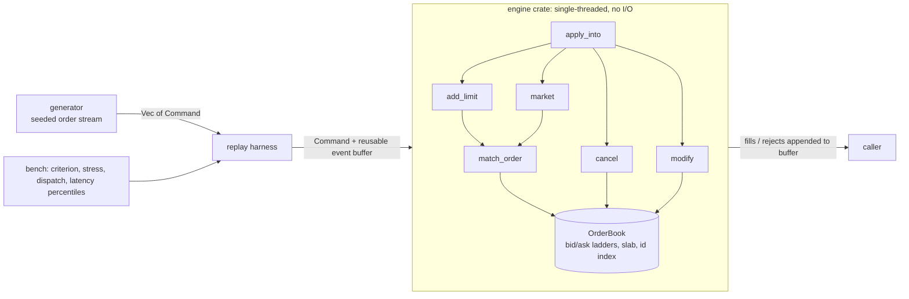

# lobster

[](https://github.com/VedantShuklaaa/lobster/actions/workflows/ci.yml)

A limit order book matching engine in Rust, built to explore low-latency systems design: cache-friendly data structures, allocation-free hot paths, and honest measurement.

> Status: v5 (occupancy bitmap for best-price advance) done. Stress workloads (narrow / wide / sparse / bursty) and a dispatch microbenchmark added.

## What is an order book?

An exchange matches buyers and sellers. The order book holds every unfilled order: **bids** (buyers, highest price first) and **asks** (sellers, lowest price first). When a new order crosses the spread, it trades against resting orders by **price-time priority**: best price first, and within a price, first-come first-served. Whatever doesn't trade rests in the book.

```
        ASKS (sellers)
  price   qty
   103     40
   102     15
   101     25    <- best ask
  ---------------  spread
   100     30    <- best bid
    99     10
    98     50
        BIDS (buyers)
```

An incoming **buy at 101 for 30** fills 25 at 101, then rests 5 at 101 as the new best bid.

## Why this project

Matching is the canonical low-latency problem: memory layout, allocation, cache behaviour, and tail latency all matter. The goal is not a full exchange (no networking, auth, or persistence). It is the core engine, built in versions, with each optimisation justified by a profile and a benchmark.

## Architecture



The engine is a pure library with zero dependencies. `book.apply_into(command, &mut events)` appends fills and rejects to a caller-owned buffer, so the hot path allocates nothing; `book.apply(command)` is a convenience wrapper that allocates a fresh `Vec`. The generator, replay and benchmarks live in separate crates so the hot path stays clean.

### Repository layout

```
lobster/
├── Cargo.toml          workspace root, release profile (LTO, panic=abort)
├── engine/             the order book (no dependencies)
│   ├── src/types.rs    Price, Qty, Order, Command, Event, RejectReason
│   ├── src/book.rs     OrderBook
│   └── tests/          unit tests + property tests (proptest)
├── generator/          deterministic synthetic order streams (seeded RNG, presets)
└── bench/              benchmarks and profiling harness
    ├── src/lib.rs      workload profiling and timed replays shared by the bins
    ├── benches/book.rs criterion throughput bench
    └── src/bin/
        ├── latency.rs  per-op latency percentiles
        ├── replay.rs   long replay loop for profiling (samply)
        ├── stress.rs   narrow / wide / sparse / bursty workloads
        └── dispatch.rs microbench: branch-mispredict cost of the command dispatch
```

### Data model (v5)

```
bids/asks: Ladder { levels: Vec<Level>, occ: Occupancy, best, active }
           Level = { head, tail }       slot indices, array indexed by price
           Occupancy = two-level bitmap (1 bit per price, 1 summary bit per 64 prices)
slab:      Vec<Node { order, prev, next }>   32 bytes per node, free list through `next`
index:     HashMap<OrderId, slot> with a fast (Fx) hasher
```

The best price is cached per side. When its level empties, the next best price is found with the occupancy bitmap: a `trailing_zeros` / `leading_zeros` on the current word, then on the summary word, then on the target word (at most three word scans, regardless of how sparse the book is).

Tradeoffs: prices must be below the configured level count (default 65,536 ticks, otherwise `Rejected(PriceOutOfRange)`), and the ladders cost about 1 MB per book plus about 8 KB of bitmap per side. The bitmap also adds a little work whenever a level becomes occupied or empty (see the narrow numbers below).

## Order semantics

| Command | Behaviour |
|---|---|
| `Add` (limit) | Matches while it crosses the spread, fills at the **maker's** price, FIFO within a level. Remainder rests at the back of its level. |
| `Market` | Matches against the opposite side at any price. Unfilled remainder is **cancelled, never rested**. If nothing fills, `Rejected(NoLiquidity)`. |
| `Cancel` | Removes a resting order. Unknown id (already filled, already cancelled, never existed) gives `Rejected(UnknownOrder)`. |
| `Modify` | Qty decrease keeps queue position. Qty increase loses priority (moves to the back). |

Other rejects: `InvalidQty` (qty = 0), `DuplicateId` (id already live), `PriceOutOfRange` (price at or above the ladder size). Bad input never panics.

## Correctness

* Unit tests for priority, partial fills, level sweeping, maker-price fills, best-price advance and fallback, and rejects on both sides.
* Property tests (`proptest`) run random command sequences and check after every command:
  * the book is never crossed (`best_bid < best_ask`)
  * the id index and the price levels contain exactly the same orders
  * linked-list integrity (prev/next/tail), no empty levels, no zero-qty resting orders
  * the cached best price and active-level count match a full scan of the ladder
  * the occupancy bitmap matches the ladder exactly (bit per level, summary bit per word)
  * quantity conservation across add, market, cancel, modify
* The occupancy bitmap is also tested against a `BTreeSet` over random set/clear sequences, at sizes that straddle word and summary-word boundaries.
* The default (narrow) generator stream is frozen by a hash test, because every published number is a replay of it.

```bash
cargo test --workspace
```

## Benchmarks

### Method

* Workload: 1,000,000 commands from the seeded generator (seed 42), around a drifting mid price within a narrow band. About 45% cancels, 5% market orders, the rest limit orders, some of which cross the spread. Peak live orders is about 8.6k.
* Throughput is measured with criterion over a full replay on a fresh, pre-sized book, reusing one event buffer.
* Per-op latency is measured with `Instant` around each `apply_into` call; the timer's own overhead is measured and subtracted. Warmup run first. Release profile with LTO.
* Profiling uses `samply` with `#[inline(never)]` wrappers added temporarily on a scratch branch, so inlined callees show up as separate rows.

```bash
cargo bench -p bench                                  # replay throughput (criterion)
cargo run --release -p bench --bin latency auto       # per-op percentiles
cargo run --release -p bench --bin stress -- v5 15    # workload shapes + throughput (15 runs)
cargo run --release -p bench --bin dispatch -- 30     # dispatch microbench (30 passes)
```

### Environments

Every number in this README so far was measured on one machine:

| Environment | Used for | Notes |
|---|---|---|
| Apple M5 MacBook Air, macOS | all results in this README | no hard core pinning on Apple Silicon (QoS hints only); the `Instant` tick is about 42 ns |
| AWS EC2, Linux (planned, roadmap B and C) | pinned-core and under-load latency, the live demo | free-tier instances are burstable and shared, so benchmark runs will use a separate on-demand instance that is terminated afterwards |

Results from different environments are never compared in one table. Each Linux result will record the instance type, CPU model, kernel version, and whether threads were pinned. CI runs on GitHub-hosted runners and checks correctness only; its timings are not used.

### Stress workloads

The default workload keeps orders within about 20 ticks of the mid, which is the best case for an array-indexed ladder. Two presets stress the other end (same seed, same 1M commands, same 65,536-tick ladder):

| Preset | Resting orders | Price range | Purpose |
|---|---|---|---|
| narrow | ~5-9k | ~1.2k ticks | original workload |
| wide | ~19k | ~61k ticks | footprint stress: whole ladder touched |
| sparse | ~70 | ~61k ticks | scan stress: long empty gaps between levels |
| bursty | ~4-9k | ~1.2k ticks | stream-shape stress: narrow's type mix, but clustered |

`bursty` is the odd one out: it does not change the book's shape but the shape of the *stream*. It keeps narrow's type mix (50/45/5) and price band, but issues runs of same-type, same-side commands (8.2% of neighbouring commands differ in type, against 54.5% in narrow) with prices dense at the touch. Its purpose is to show how much of the narrow numbers comes from the i.i.d. shape of the stream.

`cargo run --release -p bench --bin stress -- <label> 15` prints the workload shape (deterministic, identical on every machine), throughput, and a worst-case scan row. Scan statistics skip the first 10% of commands, because the book starts empty. The scan length is measured from outside the engine, as how far a side's best price moved toward worse prices after a command.

Ghost cancels (cancels of orders that were already filled) are 77% of narrow's cancels and under 5% of wide's and sparse's, so the cancel path does different work in the two regimes.

### Results

Machine: Apple M5 MacBook Air, 16 GB RAM, macOS, plugged in, nothing else running.

| Version | Replay throughput | Mean/op | p50 | p90 | p99 | p99.9 | max |
|---|---|---|---|---|---|---|---|
| v1: BTreeMap + VecDeque | 21.8 M ops/s | ~46 ns | 10 ns\* | 51 ns | 93 ns | 177 ns | 66.6 µs |
| v1.1: + fast hasher, index sized to workload (16k) | 28.0 M ops/s | ~36 ns | 13 ns\* | 13 ns\* | 96 ns | 179 ns | ~18-37 µs |
| v2: slab + intrusive level lists (O(1) cancel) | 32.5 M ops/s | ~31 ns | 11 ns\* | 12 ns\* | 54 ns | 137 ns | 14.7 µs |
| v3: caller-provided event buffer (no hot-path allocation) | 48.0 M ops/s | ~21 ns | <1 tick\* | 12 ns\* | 53 ns | 95 ns | 14-17 µs |
| v4: array-indexed price levels | 98.7 M ops/s | ~10 ns | <1 tick\* | 1 tick\* | 1 tick\* | 1 tick\* | 13.6-17.8 µs |
| v5: occupancy bitmap | ~96.5 M ops/s | ~10 ns | <1 tick\* | 1 tick\* | 1 tick\* | 2 ticks\* | ~16 µs |

\* Latency percentiles are quantized to about 42 ns (the `Instant` tick on Apple Silicon is 24 MHz), so p50/p90 are not meaningful per-op numbers and single-tick differences are noise. From v3 on, the percentiles sit at or near the timer floor; only throughput and the max (OS jitter) carry information.

Throughput is criterion's median over 10 samples; mean/op is 1 / throughput. Percentiles are per call with timer overhead subtracted. Workload: 1,000,000 commands, seed 42.

### Stress workloads (M5, `stress` bin, 15 runs, median, M ops/s)

| Version | narrow | wide | sparse | worst-case scan (64k-level gap) |
|---|---|---|---|---|
| v4: array-indexed levels | 93.2 | 63.1 | 52.7 | 15.3 µs |
| v5: + occupancy bitmap | 89.8 | 68.4 | 93.2 | 0.01 µs |

v5 on `bursty`: **118.8 M ops/s** (1.31x narrow); v4 was not measured on it. A rerun of the `stress` bin on the same day gave narrow 90.3, bursty 118.8, wide 68.0, sparse 94.4 M ops/s, within about 1.5% of the table. One bursty run in the 15 was slow (min 81.5, max 120.2); the median is unaffected.

**v4 was scan-bound on sparse books.** The worst-case row measured 0.24 ns per empty level, and sparse scans 35.8 levels per command on average, which predicts 8.6 ns per command; the measured sparse penalty against narrow was 8.3 ns (10.7 ns at 93.2 M ops/s vs 19.0 ns at 52.7 M ops/s). The bitmap removed it: sparse went from 52.7 to 93.2 M ops/s and the worst-case scan from 15.3 µs to 0.01 µs.

**The same model predicted the smaller gain on wide:** 5.8 levels per command × 0.24 ns is about 1.4 ns per op, against 1.2 ns measured (63.1 to 68.4 M ops/s).

**The bitmap is not free.** Narrow went from 93.2 to 89.8 M ops/s (about −4%), the cost of a bit set or clear whenever a level becomes occupied or empty, on a workload that never had a scan problem.

**Wide still runs at 0.76x of narrow** (14.6 ns vs 11.1 ns per op), and the remainder is not scan. The v5 profile (next section) puts about 48% of wide's time in slab and ladder structural operations (`Slab::unlink` alone is 19.5%), against about 15% on narrow. That points at cache misses on the list neighbours of removed orders, but a profile shows where the time goes, not why; this has not been isolated with an intervention.

**Absolute numbers differ between harnesses.** The criterion bench (main table, v5 about 96.5 M ops/s) and the `stress` bin (v5 narrow 89.8 M ops/s) replay the same narrow workload through the same engine. They are different binaries, and a similar gap appeared between two criterion binaries over identical engine code (probably code layout, unproven). Compare versions only within one harness.

### How much of narrow is stream shape?

`bursty` has the same engine, type mix and price band as narrow, but the stream is clustered. v5 runs it at 118.8 M ops/s against narrow's 90.3 (11.1 ns vs 8.4 ns per op), a gap of 2.65 ns per command.

The `dispatch` bin (next section) says how much of that is branch prediction: with trivial handlers, the mispredict cost falls from 2.59 ns on narrow to 0.61 ns on bursty (2.36 to 0.52 ns on the tag stream), about 1.8-2.0 ns, or roughly three quarters of the gap. The remaining 0.7 ns or so is not explained, and it should not be: bursty changes more than the order of command types. Its mean live book is smaller (3.7k vs 4.8k orders), its prices cluster at the touch, ghost cancels are 81% of cancels (narrow 77%), and best-price moves are more frequent (20k scans vs 14.7k). The dispatch microbench isolates only the type sequence.

So narrow's ~90 M ops/s is pessimistic for a feed with clustering, and bursty's ~119 M ops/s is a stream with clustering built in. Treat the two as bracketing the engine, not as predictions: how clustered a real feed is has not been measured here.

### What the profiles showed

| Profile | Findings | Decision |
|---|---|---|
| v1 | id `HashMap` removal 13%, `add_limit` 19%, `cancel` 8% (linear level scan), malloc/free about 10%. `BTreeMap` rows under 1%, but its lookups were inlined into other rows, so that reading was wrong. | fast hasher, then slab |
| v2 | allocation (malloc plus the zeroing and copying around it) about 20% of engine time | caller-provided event buffer |
| v3, with `#[inline(never)]` on every tree and hash call | `BTreeMap` about 40%, id hash about 9%, slab ops about 2.4%, allocation about 1% | array-indexed price levels |
| v5, narrow | `apply_into` 28-31%, `match_order` 27-29%, id index 18-19%, slab about 11%, ladder about 4% | dispatch microbench, id table experiment |
| v5, wide | slab + ladder structural ops about 48% (`Slab::unlink` 19.5%), `apply_into` 25%, id index 14%, `match_order` 6.4% | not yet addressed |

Lesson: a function-level profile hides inlined callees. Forcing the suspects into separate rows changed the diagnosis. Shares move by about ±3 points between runs, and sampling skid smears stalls across neighbouring rows, so read them as rough.

### Where `apply_into`'s time goes

`apply_into` showed 4.1-4.6 ns per command of self time in every v5 profile, on every workload. The `dispatch` bin replays the same command stream through a `match` with trivial handlers (no book, no memory structure) and changes one thing at a time. On the M5, in ns per command:

| Variant | narrow | bursty |
|---|---|---|
| random order (what the engine sees) | 3.31 | 1.33 |
| same commands sorted by type (predictable branches) | 0.72 | 0.73 |
| 9-byte tag + payload stream, random order | 3.18 | 1.34 |
| 9-byte tag + payload stream, sorted | 0.82 | 0.82 |
| loop and memory-read floor, no dispatch | 0.07 | 0.07 |
| neighbouring commands of different type | 54.5% | 8.2% |

* **Branch mispredicts on narrow: about 2.5 ns per command** (2.59 from the command stream, 2.36 from the tag stream). That is roughly 55-60% of `apply_into`'s self time and about a quarter of the per-op time. On bursty it is 0.61 ns (0.52 from the tag stream).
* **Stream reads: about 0.1-0.2 ns.** The 24 MB command stream (1M × 24 bytes) is not the bottleneck.
* **Call plus dispatch: about 0.65-0.75 ns** when everything is predictable.

On narrow the command types are drawn i.i.d. (50/45/5), so 54.5% of neighbouring commands differ in type and the branch predictor cannot learn the sequence. That is a property of the synthetic stream, not engine overhead, and no dispatch rewrite can predict random input. The microbench measures a flush on an early-resolving branch with trivial handlers, so treat 2.5 ns as an estimate, not an exact share of the real engine.

### Tried and rejected

**Flat open-addressing id table** (linear probing, backward-shift deletion), with and without a 1-byte tag array, instead of `HashMap` + Fx. M5, 3 alternating runs each, medians against v5 in M ops/s:

| | narrow | wide | sparse |
|---|---|---|---|
| v5 (HashMap + Fx) | 90.6 | 68.3 | 93.5 |
| flat table | 85.5 (−6%) | 68.9 (noise) | 102.6 (+10%) |
| flat table + 1-byte tags | 83.5 (−8%) | 68.9 (noise) | 99.4 (+6%) |

Narrow is 77% ghost cancels. The tag array was meant to make that miss path cheap by keeping it in L1, but it made narrow worse, so the cause of the narrow regression is unexplained (code layout is possible). Not adopted; the headline workload regressed.

### Known limits

* All workloads are synthetic. The wide book has a large hole around the mid (uniform offsets), which real books don't.
* The generated stream draws command types i.i.d. (50/45/5), so about 55% of neighbouring commands differ in type. On the M5 that costs about 2.5 ns per command (roughly a quarter of per-op time) in branch mispredicts alone; real feeds are burstier. The `bursty` preset measures this (118.8 vs 90.3 M ops/s), but how clustered a real feed is has not been measured here.
* Prices must fit the configured ladder size.
* Single instrument, single thread, no persistence or networking.
* Percentiles are at the timer floor; per-operation-type latency needs batched timing.
* In narrow, 77% of cancels are ghost cancels (the order was already filled), which is high for a real feed.

### Remaining costs

* One id lookup per resting order: 14-19% of the v5 profiles (`HashMap` + Fx; a flat table was tried and rejected)
* `Slab::unlink` on wide: 19.5% of the profile
* `apply_into` dispatch: mostly branch mispredicts on the i.i.d. command mix, about 2.5 ns per command
* Zero-filling the ladders and bitmaps when a fresh book is created (about 1 MB)

## Roadmap

* \[x] v1: naive book, full test suite, property tests, baseline numbers
* \[x] Profile v1 (samply) to find the real bottleneck
* \[x] v1.1: fast hasher, workload-sized index
* \[x] v2: slab-allocated orders, intrusive level lists (O(1) cancel)
* \[x] v3: caller-provided event buffer (no allocation on the hot path)
* \[x] v4: array-indexed price levels
* \[x] Wide/sparse-book workloads (stress case) and comparison of v4 against v5
* \[x] v5: occupancy bitmap for best-price advance
* \[x] Dispatch microbench: branch mispredicts are about 2.5 ns of `apply_into`'s per-command cost
* \[x] Flat id table, with and without tags: tried and rejected
* \[x] Bursty stream preset: 1.31x narrow, about three quarters of the gap is branch prediction

### Next, in this order

* \[ ] **A. CI**: `fmt`, `clippy`, and tests (debug and release) on every push and PR (GitHub Actions)
* \[ ] **B. Linux environment**: AWS EC2 instance, and CD from `main` (build in Actions, deploy, restart the service)
* \[ ] **C. Engine thread behind an SPSC ring**, with pinned-core end-to-end latency percentiles under load (Linux)
* \[ ] **D. Static benchmarks page** (Vercel), reading a results JSON written by a manually triggered benchmark workflow
* \[ ] **E. Live demo**: Rust WebSocket server around the engine, with an order book UI

### Later (unordered)

* \[ ] Engine-assigned handles (slot + generation) instead of a hash map
* \[ ] Per-operation-type latency breakdown (batched timing, to get under the 42 ns tick)
* \[ ] `Cancelled { id }` event for successful cancels
* \[ ] Replay of real market data (L2/L3) instead of synthetic only

### Planned experiment: tiered regional books

Order flow from a distant region pays a full network round trip to a central book. The experiment: put a small book per region that matches same-region orders instantly, guarded by a cached copy of the global best bid/offer, and forward unmatched orders to the main book after a short hold window.

Measure against the single-book baseline using the same replay:

* fraction of orders matched locally
* mean and p99 latency saved
* priority violations (trades that differ from global price-time priority) as a function of the hold window and the safety margin

A v2 of the experiment adds a lease: held orders are visible in the main book, and the main book must ask the owning edge to confirm before matching them.

## License

MIT
