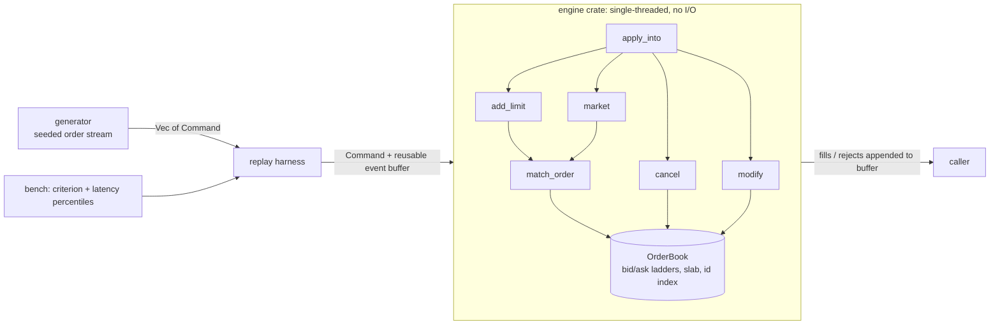

# lobster

A limit order book matching engine in Rust, built to explore low-latency systems design: cache-friendly data structures, allocation-free hot paths, and honest measurement.

> Status: v4 (array-indexed price levels) done, 98.7 M ops/s on the synthetic replay. Wide-book stress test and dense id index next.

## What is an order book?

An exchange matches buyers and sellers. The order book holds every unfilled order: **bids** (buyers, highest price first) and **asks** (sellers, lowest price first). When a new order crosses the spread, it trades against resting orders by **price-time priority**: best price first, and within a price, first-come first-served. Whatever doesn't trade rests in the book.

```
        ASKS (sellers)
  price   qty
   103     40
   102     15
   101     25    <- best ask
  ---------------  spread
   100     30    <- best bid
    99     10
    98     50
        BIDS (buyers)
```

An incoming **buy at 101 for 30** fills 25 at 101, then rests 5 at 101 as the new best bid.

## Why this project

Matching is the canonical low-latency problem: memory layout, allocation, cache behaviour, and tail latency all matter. The goal is not a full exchange (no networking, auth, or persistence). It is the core engine, built in versions, with each optimisation justified by a profile and a benchmark.

## Architecture



The engine is a pure library with zero dependencies. `book.apply_into(command, &mut events)` appends fills and rejects to a caller-owned buffer, so the hot path allocates nothing; `book.apply(command)` is a convenience wrapper that allocates a fresh `Vec`. The generator, replay and benchmarks live in separate crates so the hot path stays clean.

### Repository layout

```
lobster/
├── Cargo.toml          workspace root, release profile (LTO, panic=abort)
├── engine/             the order book (no dependencies)
│   ├── src/types.rs    Price, Qty, Order, Command, Event, RejectReason
│   ├── src/book.rs     OrderBook
│   └── tests/          unit tests + property tests (proptest)
├── generator/          deterministic synthetic order stream (seeded RNG)
└── bench/              criterion throughput bench, latency percentiles, profiling harness
    ├── benches/book.rs
    └── src/bin/        latency.rs, replay.rs
```

### Data model (v4)

```
bids/asks: Ladder { levels: Vec<Level>, best, active }
           Level = { head, tail }       slot indices, array indexed by price
slab:      Vec<Node>                    Node = { order, prev, next }, free list for reuse
index:     FastMap<OrderId, slot>       Fx-hashed, sized to the workload
```

Resting orders live in one slab; each price level is an intrusive doubly linked list of slab slots, so cancel is O(1) (look up the slot, unlink, push it on the free list). Price lookup is a direct array index with no tree walk. The best price is cached per side and, when its level empties, advances by scanning toward worse prices; a count of non-empty levels guarantees the scan terminates. Prices and quantities are integers (`u32` ticks and lots), never floats.

Tradeoffs: prices must be below the configured level count (default 65,536 ticks, otherwise `Rejected(PriceOutOfRange)`), the ladders cost about 1 MB per book, and a sparse book makes the best-price scan longer.

## Order semantics

| Command | Behaviour |
|---|---|
| `Add` (limit) | Matches while it crosses the spread, fills at the **maker's** price, FIFO within a level. Remainder rests at the back of its level. |
| `Market` | Matches against the opposite side at any price. Unfilled remainder is **cancelled, never rested**. If nothing fills, `Rejected(NoLiquidity)`. |
| `Cancel` | Removes a resting order. Unknown id (already filled, already cancelled, never existed) gives `Rejected(UnknownOrder)`. |
| `Modify` | Qty decrease keeps queue position. Qty increase loses priority (moves to the back). |

Other rejects: `InvalidQty` (qty = 0), `DuplicateId` (id already live), `PriceOutOfRange` (price at or above the ladder size). Bad input never panics.

## Correctness

* Unit tests for priority, partial fills, level sweeping, maker-price fills, best-price advance and fallback, and rejects on both sides.
* Property tests (`proptest`) run random command sequences and check after every command:
  * the book is never crossed (`best_bid < best_ask`)
  * the id index and the price levels contain exactly the same orders
  * linked-list integrity (prev/next/tail), no empty levels, no zero-qty resting orders
  * the cached best price and active-level count match a full scan of the ladder
  * quantity conservation across add, market, cancel, modify

```bash
cargo test --workspace
```

## Benchmarks

### Method

* Workload: 1,000,000 commands from the seeded generator (seed 42), around a drifting mid price within a narrow band. About 45% cancels, 5% market orders, the rest limit orders, some of which cross the spread. Peak live orders is about 8.6k.
* Throughput is measured with criterion over a full replay on a fresh, pre-sized book, reusing one event buffer.
* Per-op latency is measured with `Instant` around each `apply_into` call; the timer's own overhead is measured and subtracted. Warmup run first. Release profile with LTO.
* Profiling uses `samply` with `#[inline(never)]` wrappers added temporarily on a scratch branch, so inlined callees show up as separate rows.

```bash
cargo bench -p bench                            # replay throughput (criterion)
cargo run --release -p bench --bin latency auto # per-op percentiles
```

### Results

Machine: Apple M5 MacBook Air, 16 GB RAM, macOS, plugged in, nothing else running.

| Version | Replay throughput | Mean/op | p50 | p90 | p99 | p99.9 | max |
|---|---|---|---|---|---|---|---|
| v1: BTreeMap + VecDeque | 21.8 M ops/s | ~46 ns | 10 ns\* | 51 ns | 93 ns | 177 ns | 66.6 µs |
| v1.1: + fast hasher, index sized to workload (16k) | 28.0 M ops/s | ~36 ns | 13 ns\* | 13 ns\* | 96 ns | 179 ns | ~18-37 µs |
| v2: slab + intrusive level lists (O(1) cancel) | 32.5 M ops/s | ~31 ns | 11 ns\* | 12 ns\* | 54 ns | 137 ns | 14.7 µs |
| v3: caller-provided event buffer (no hot-path allocation) | 48.0 M ops/s | ~21 ns | <1 tick\* | 12 ns\* | 53 ns | 95 ns | 14-17 µs |
| v4: array-indexed price levels | 98.7 M ops/s | ~10 ns | <1 tick\* | 1 tick\* | 1 tick\* | 1 tick\* | 13.6-17.8 µs |

\* Latency percentiles are quantized to about 42 ns (the `Instant` tick on Apple Silicon is 24 MHz), so p50/p90 are not meaningful per-op numbers and single-tick differences are noise. From v3 on, the percentiles sit at or near the timer floor; only throughput and the max (OS jitter) carry information.

Throughput is criterion's median over 10 samples; mean/op is 1 / throughput. Percentiles are per call with timer overhead subtracted. Workload: 1,000,000 commands, seed 42.

### What the profiles showed

| Profile | Findings | Decision |
|---|---|---|
| v1 | id `HashMap` removal 13%, `add_limit` 19%, `cancel` 8% (linear level scan), malloc/free about 10%. `BTreeMap` rows under 1%, but its lookups were inlined into other rows, so that reading was wrong. | fast hasher, then slab |
| v2 | allocation (malloc plus the zeroing and copying around it) about 20% of engine time | caller-provided event buffer |
| v3, with `#[inline(never)]` on every tree and hash call | `BTreeMap` about 40%, id hash about 9%, slab ops about 2.4%, allocation about 1% | array-indexed price levels |

Lesson: a function-level profile hides inlined callees. Forcing the suspects into separate rows changed the diagnosis.

### Tried and rejected

Pre-sizing the id index to 1M entries. Peak live orders in this workload is about 8.6k, so the oversized table caused cache/TLB misses: p99.9 rose from about 180 ns to 700-1000 ns. Sized to about 2x peak, it stays hot in cache.

### Known limits

* The synthetic workload keeps orders in a narrow band near the mid price, which is the best case for an array-indexed ladder (hot cache, short best-price scans). A wide, sparse book is the stress case; results to be added.
* Prices must fit the configured ladder size.
* Single instrument, single thread, no persistence or networking.
* Percentiles are at the timer floor; per-operation-type latency needs batched timing.

### Remaining costs

* One id-hash lookup per resting order (about 9% in the v3 profile)
* Zero-filling the ladders when a fresh book is created (about 1 MB)
* `apply_into` dispatch (about 15% self time in the split profile, unexplained)

## Roadmap

* \[x] v1: naive book, full test suite, property tests, baseline numbers
* \[x] Profile v1 (samply) to find the real bottleneck
* \[x] v1.1: fast hasher, workload-sized index
* \[x] v2: slab-allocated orders, intrusive level lists (O(1) cancel)
* \[x] v3: caller-provided event buffer (no allocation on the hot path)
* \[x] v4: array-indexed price levels
* \[ ] Wide/sparse-book workload (stress case) and comparison against v3
* \[ ] Dense id index (slab handle) instead of a hash map
* \[ ] Per-operation-type latency breakdown (batched timing, to get under the 42 ns tick)
* \[ ] `Cancelled { id }` event for successful cancels
* \[ ] Replay of real market data (L2/L3) instead of synthetic only

### Planned experiment: tiered regional books

Order flow from a distant region pays a full network round trip to a central book. The experiment: put a small book per region that matches same-region orders instantly, guarded by a cached copy of the global best bid/offer, and forward unmatched orders to the main book after a short hold window.

Measure against the single-book baseline using the same replay:

* fraction of orders matched locally
* mean and p99 latency saved
* priority violations (trades that differ from global price-time priority) as a function of the hold window and the safety margin

A v2 of the experiment adds a lease: held orders are visible in the main book, and the main book must ask the owning edge to confirm before matching them.

## License

MIT
